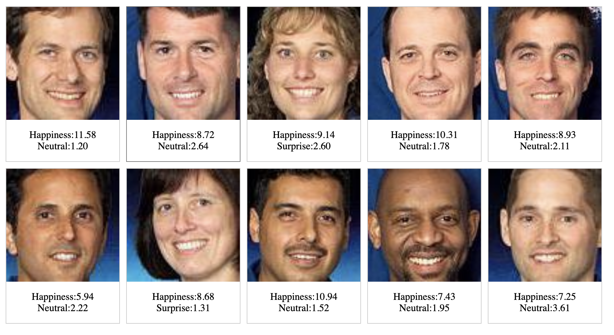
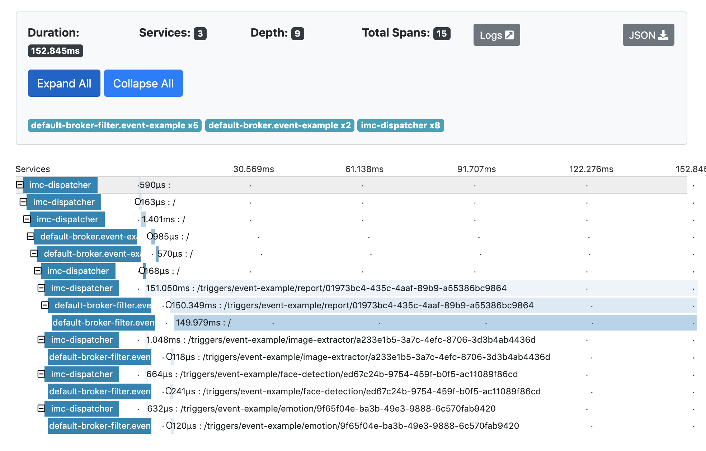

# khappygo
This repository contains the support of a talk about ML in production (knative, ONNX, and Go)

This repository contains all the code to:

- instantiate a k8s cluster on GCP (via terraform)
- add the knative eventing CRDs (channel is InMemory by now)
- add the tracing system with zipkin (again in memory)
- create the triggers
- compile and deploy the services

### Services

The goal of the application is to create a database of sentiments of people from a picture.
The application is composed of several services:

- face detection
- image extraction
- sentiment analysis
- data management
- ui

The face detection and sentiment analysis are deep neural networks pre-encoded with ONNX.

_Note_: the code is not fully tested, and probably only works in my environment.

#### Goals

The goal of this presentation are multiple:

- to show that a ML service can be decoupled (ports and adapters): The business logic (software 2.0) is using ONNX, and the regular part is using software 1.0.
(see this [blog post](https://blog.owulveryck.info/2019/08/16/a-simple-face-detection-utility-from-python-to-go.html) for more info)
- to show how to pass from a program to a software with "domain events" (see [this talk](https://www.youtube.com/watch?v=tISy7EJQPzI&t=8m17s) for the différence)
- to show how [knative eventing](https://knative.dev/docs/eventing/) is a good support for the services
- to show how a service can easily replaced by changing the trigger (passing from "yolo" to "pigo" - aka: you don't need deep learning :))

But most of all:
- Dev Ops and Data-Scientists mustcollaborate, but, thanks to a good level of abstraction, they don't need to master each-other's area of expertise.

## Workflow

This is a simple (and outdated) workflow, describing the basic principle:

# Result

### Source

### Result

### Traces

# Installation

TODO
### Models

#### Deep learning
The deep learning models are encoded in ONNX and stored using git-lfs. see the [gofaces](https://github.com/owulveryck/gofaces) repo for more info.

Two pre-trained models are used:

- Tiny Yolo v2
- emotion fer+

#### non deep learning

This POC also uses [pigo](https://github.com/esimov/pigo) as an improvement to the face detection service. The _cascade_ file is also included in this repo.

# Slides

The slides are in progress.
They are in the present format an best viewed with `github.com/owulveryck/present`

